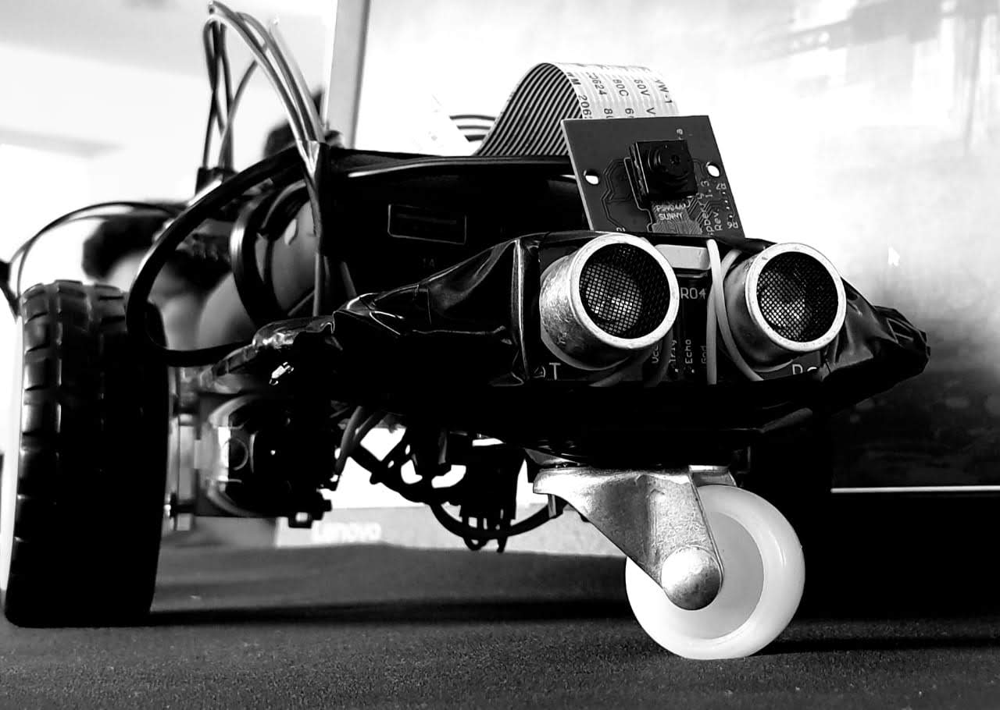

## The Inception of this project
 
   The death count in emergencies is high, not only because of the people present there
but also because of the people sent to rescue them. Sending our armed forces
without proper knowledge of the situation always ends with more casualties than
we expect. This is what we tried to clear. We have an idea for a small and
cost-effective rover that can provide a live video feed of the area and can be controlled via a web server.

## Our main aim 
 It is to assess situations more accurately before we make a move and have to risk any lives for the sake of others. 
 
The video feed from our rover can be used to check if any victims are still near the site of danger.
We are also planning to use fire-resistant material if we
get our hands on it so that we can still use the rover if the emergency is related to fire. It is currently powered by a power bank and can work for an hour or two independently based on usage. It is however, still tru that this cannot replace the presense of actual humans but it can, for sure, help in assessing the risk of entering a place.If provided with proper funding, this rover
can be a revolutionary breakthrough for emergencies.

## This Project can be used in:
- A case of mine collapse, if it is unknown whether there is any other person *alive* inside the mine to be rescused.
Sending in another person to do this job will add risk to the already out-of-balance situation.
- In case of epidemics to replace humans who will be under risk of getting infected themselves when working as
  - Lawkeepers
  - Health Workers
  - Nurses or Helpers in a hospital setting.
- In case of Fire accidents to check and alert the most affected regions for faster response

## Parts/Software we used in building this
### Hardware
- Raspberry pi 3
- Pi cam
- Chassis for rover
- Motor controller Board
- Geared Motors * 2
- Power supply
- UltraSonic Sensor
### Software
- Python programmes for controlling the Rover wirelessly.
- Python based web server for accessing live video data.
- Html/javascript for web page integration of controls and videofeed.
- Vnc viewer app to connect to Rpi
- Python program to avoid object collision
